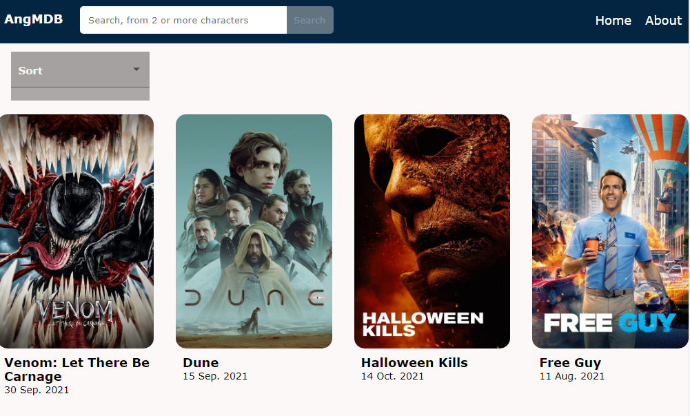

## Movie DB. Angular

**Here I made an app of movie DB API request.**
Try the App: [bd.netlify.app](https://mystifying-colden-07d4bc.netlify.app)
<a href="https://mystifying-colden-07d4bc.netlify.app" target="blank">

</a>

**- There is a ```search-component``` with navigation between two pages ```Home``` and ```About```. Also ```search-component``` has reactive form for searching**

**- Home-component has template-driven form for sorting movies and child component ```movie-list``` wich send and recive data**

**- In ```movie-list``` used pipe to convert time to another format. By clicking on movie from list open ``movie-detail`` component**
